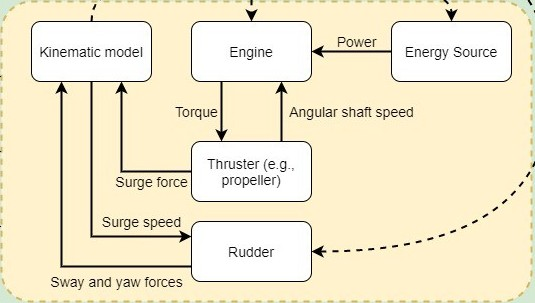

# Dynamic Systems Accident Simulator (DySAS)

This python package implements a simulator for dynamic systems as state-space differential equation models.
The main objective is to simulate the state of a generic dynamic system in time until an accident (or some undesired consequence) occurs.
As a case-study, this package implements a generic ship's components (e.g., engine, energy source, thruster, etc) as state-space models, and a simulator class which simulates the components and their connections in time.
A diagram of the ship's "system dynamics" as components can be seen below.



The ship kinematic models are based on Thor Fossen and Asgeir Johansen's Marine System Simulator (MSS) MATLAB toolbox.

## Dependencies

* [numpy](https://www.numpy.org/)
* [scipy](https://www.scipy.org/)
* [pymap3d](https://pypi.org/project/pymap3d/)

## Installation

Clone the repository and install locally:

```pip -e <path_to_repository>```

## Usage

Simply import the class wanted and instantiate it. For example:

```
from DYSAS.Vessels import Ship

ship = Ship()
```

The ship's constructive parameters may be updated by changing the variables directly:

```
ship.m = 1      # Mass, kg
ship.Xg = 0     # X coordinate for center of gravity, meters
```

For the "ship" component, users can find all the parameters in the [Ship class](https://github.com/rgmaidana/dysas/blob/master/DYSAS/Vessels/__init__.py), and an explanation of the parameters in the [Marine Cybernetics lecture notes](http://folk.ntnu.no/assor/Public/2018-08-20%20marcyb.pdf).

## Examples

This package currently contains 4 [examples](https://github.com/rgmaidana/dysas/tree/master/examples):

* **[!! Not currently compatible with the component-based simulation, must define an engine and actuation mode !!]** Simulation of NTNU's Gunnerus Research Vessel;
* Simulation of NTNU's CyberShip Drilling Vessel scaled model, using the thruster/rudder components;
* Simulation and linear PID control (i.e., surge speed and heading control) of NTNU's CyberShip Drilling Vessel scaled model, using the thruster/rudder model;
* Simulation, linear PID control (i.e., surge speed and heading control), and reference following (i.e., following a set of waypoints) of NTNU's CyberShip Drilling Vessel scaled model, using the thruster/rudder model;

You can run the examples with:

```python <example>.py```

If you want to plot the results, you must install the matplotlib package:

```pip install matplotlib```

## Acknowledgements

* [Thor I. Fossen](https://www.ntnu.edu/employees/thor.fossen)
* [Asgeir J. Sørensen](https://www.ntnu.edu/employees/asgeir.sorensen)
* [MATLAB Marine Systems Simulator toolbox](https://github.com/cybergalactic/MSS)

## Collaborators

* [Renan Maidana](https://github.com/rgmaidana)
